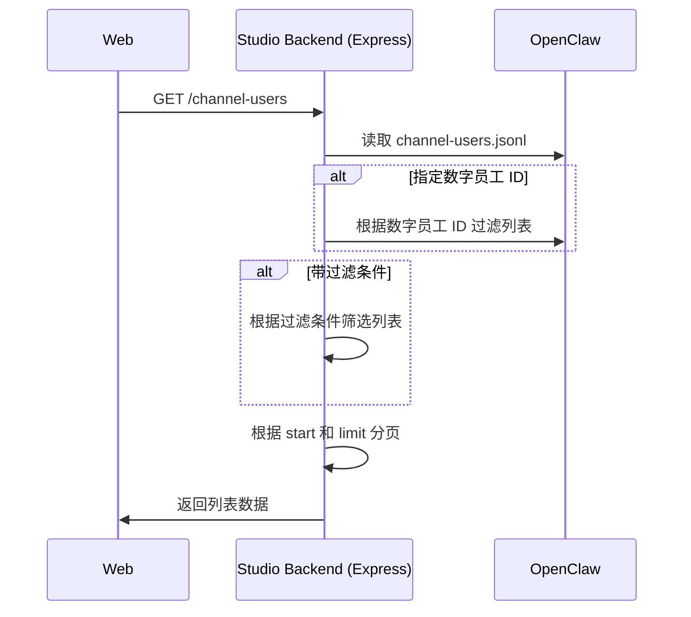

# 通道消息

## 需求背景

当用户在数字员工平台向数字员工下达指令或制定计划时，需要向指定通道发送通知或定时任务执行结果，例如：

- 每日汇总前一日的项目进度并主动发送给项目管理员。
- 收集材料生成 PPT 并发送给领导审核。

因此需要将通道用户与数字员工平台打通，使数字员工能够向指定的通道用户发送消息。

## 特性设计

### 术语

**通道**

指消息的投递渠道，例如：飞书、钉钉、企业微信等。

### 角色定义

|  角色  |  说明  |
|  --  |  --  |
| 管理员 | - 管理通道用户<br>- 配置数字员工消息范围 |
| 普通用户 | - 在聊天中 @通道用户 向指定渠道发送消息 |

### 通道用户管理

管理员可以在【系统配置】/【通道用户】界面统一管理所有的通道用户账号。【通道用户】功能支持：

- 查看通道用户列表
- 手动添加/编辑/删除通道用户
- 使用 JSONL 模板导入导出通道用户

#### 查看通道用户列表

- 通道用户列表展示以下信息：
  * 用户显示名
  * 所属通道
- 列表支持按“通道类型“进行过滤，并按显示名进行部分匹配。
- 如果一个用户属于多个通道，则显示两条独立的记录。

#### 添加通道用户

- 添加通道用户时，需要输入用户的显示名，选择通道类型，并输入对应通道的用户的 User ID。
- 支持的通道类型有：飞书、钉钉。
- 显示名 + 通道类型的组合为全局唯一，例如：可以同时存在 “Alice + 飞书“ 和 “Alice + 钉钉“，但不可以存在两个 “Alice + 飞书“的组合。

#### 编辑通道用户

- 编辑通道用户时，同样需要检查显示名 + 通道类型的组合是否唯一。
- 可编辑项包括：显示名、通道类型和 User ID。

### 删除通道用户

- 删除通道用户时，需要二次确认。
- 删除通道用户时，必须关联删除已配置在通道消息范围白名单中的通道用户 ID。
- 删除通道用户后，对于历史消息中的通道用户，显示格式为：`<通道>用户: 显示名#已删除`，例如：飞书用户: Zak#已删除。（PLAN里面提及的用户被删除如何处理）

### 导出通道用户

- 以 `JSONL` 的数据格式存储通道用户列表。
- 导出文件的文件名格式为：`通道用户_<日期时间>.jsonl`，例如：`通道用户_2026_04_16_15_16_08.jsonl`。

### 导入通道用户

由于导入的 JSONL 数据不再经过转换而是被直接使用，因此需要对 JSONL 文件进行严格的格式检查。

- 导入通道用户时，需要检查 JSONL 所有记录行的完整性，对于数据格式不正确的文件直接报错并中断。
- 报错信息包括：
  * 错误行。
  * 错误原因：可能是字段缺失、数据类型错误，或其他原因。
  - 如果是重复记录，则提示重复行 + 重复原因。例如：假设 行1、行 10、行 20 为重复数据，则对行 10、行 20 进行。
  - 重复原因可能是：
    * user_id 重复
    * 显示名 + 通道类型的组合重复


### 数字员工 - 通道消息范围

管理员在创建数字员工时，需要为该数字员工配置消息白名单。消息白名单限制了该数字员工能够发送通道消息的用户范围。

例如，假设存在以下通道用户：

```jsonl
{"displayName":"Alice","channel":{"type":"feishu","user_id":"feishu_user_id_1"}}
{"displayName":"Bob","channel":{"type":"feishu","user_id":"feishu_user_id_2"}}
{"displayName":"Zak","channel":{"type":"feishu","user_id":"feishu_user_id_3"}}
```

当设定名单为：

```json
[
    "feishu_user_id_1", "feishu_user_id_3"
]
```

此时该数字员工只能向 Alice（"feishu_user_id_1"） 和 Zak（"feishu_user_id_3"） 发送消息。

### 发送消息给通道用户

- 普通用户在和数字员工对话时，可以通过 @ 触发选择通道用户。
- 通道用户列表记录显示格式为：`<通道类型>用户:<显示名>`，例如 “飞书用户: Zak“。
- 通道用户列表首次展示 10 条，滚动加载每次 +10 条记录。
- 用户可以在聊天框中边输入边过滤通道用户列表，过滤不区分大小写。例如：
  1. 用户输入 @ 时，出现按拼音首字母排序的用户列表。
  2. 用户输入 `@王子` 时，列表中出现显示名包含 `王子` 的用户，按照以下规则排序：
    * 匹配位置靠前优先，例如：`王子秦` 要出现在 `数学王子秦老师` 前。
    * 多通道匹配时，按通道名称首字母排序
- 列表始终聚焦第一条通道用户记录，当用户输入空格时，在输入框中生成通道用户内联块。
- 输入框中的通道用户内联块显示格式为：`<通道类型>用户: <显示名>`，例如 “飞书用户: Zak“。
- 在已发送的消息和历史消息中，同样使用内联块格式显示通道用户。

## 实现设计

### 通道用户文件

- 使用 JSONL 数据格式来存储通道用户记录，Schema 为：

```yaml
$schema: "http://json-schema.org/draft-07/schema#"
title: 通道用户记录
type: object
description: JSONL 中的每一行代表一个通道用户对象

properties:

  displayName:
    type: string
    description: 通道用户的显示名
  
  channel:
    type: object
    description: 通道信息
    properties:
      type:
        type: string
        enum: ["feishu", "dingding"]
      user_id:
        type: string
        description: 通道用户的 User ID
```

- 通道用户文件存放路径为 `~/.openclaw/workspace/channel-users.jsonl`

### 导入

- JSONL 中的记录必须保证以下字段（组合）全局唯一：
  * channel.user_id
  * displayName + channel.type

### 导出

- 导出通道用户时，通过 HTTP GET 协议读取 `channel-users.jsonl` 并导出


### `openclaw.json` 中的通道用户配置

`openclaw.json` 中定义了：

 - 通道与数字员工的绑定关系
 - 通道的投递范围 

#### 通道与数字员工的绑定关系

```json
{
  "bindings": [
    {
      "agentId": "a987374f-afea-4dd1-8ac1-894217306b1b",
    	"match": {
      	"channel": "feishu",
      	"accountId": "cli_a94a1d897cb85cbb"
    	}
    }
  ]
}
```
-  数字员工 ID 与 `agentId`相同，可以通过 `agentId` 来匹配数字员工。
- `match.channel` 和 `match.accountId` 表示该数字员工绑定的通道。

#### 通道的投递范围

```json
{
  "channels": {
    "feishu": {
      "accounts": {
        "cli_a94a1d897cb85cbb": {
          "appId": "cli_a94a1d897cb85cbb",
          "dmPolicy": "open",
          "allowFrom": [
            "feishu_user_id_1",
            "feishu_user_id_3"
          ]
        }
      }
    }
  }
}
```

- 通过 `<channelType>.accounts.<accountId>` 来匹配数字员工绑定的通道。
- 匹配到通道后，`allowFrom` 列表即为该数字员工的可以投递消息的通道用户列表。

### 配置数字员工消息投递范围

- 通过 PUT /digital-human/:id/channel-users 接口来更新特定数字员工的消息投递范围。
- 通过接口将通道用户的 User ID 列表覆盖 `<channelType>.accounts.<accountId>.allowFrom`。
- 使用 WebSocket RPC 协议中的 `config.patch` 方法局部更新 `<channelType>.accounts.<accountId>.allowFrom` 来设定数字员工的投递范围，该方法只支持覆盖更新。参考：@docs/references/openclaw-websocket-rpc/config.md

### 获取通道用户列表

以下逻辑适用于：

- 配置数字员工消息投递范围时，获取全部通道用户列表。
- 用户 @通道用户 时，获取过滤后的通道用户列表。



#### 根据数字员工 ID 过滤列表

- 按照以下流程实现根据数字员工 ID 过滤通道用户列表：

1. 读取 `openclaw.json`
2. 从 `bindings` 字段获取数字员工 ID（agentID）和 channel 的关系。
3. 从 `channels` 字段获取该 channel 可投递消息的通道用户 User ID 列表。

#### 过滤条件

- 过滤条件支持传入 `type` 和 `displayName`，根据过滤条件参数进一步筛选过滤列表。

### 获取数字员工的 @通道用户 列表

- 通过 HTTP GET /digital-human/:id/channel-users 获取指定数字员工的可 @通道用户 列表

### 投递消息

消息中的内联块，展开为原始数据结构为使用 “{}“ 包含的结构：`{channelMessage:<channelType>:<displayName>:<User ID>}`，示例：

当用户向数字员工发送指令：

```text
汇总 XX 项目进度，发送项目报告并发送给 [飞书用户: Zak]
```

指令文本需要被解析：

- [飞书用户: Zak] 为内联块，底层消息结构为：`@{channelMessage:feishu:displayName:Zak:userid:feishu_user_id_3}`
- 转换成 Agent 收到的原始消息：
    ```text
    汇总 XX 项目进度，发送项目报告并发送给 @{channelMessage:feishu:displayName:Zak:userid:feishu_user_id_3}
    ```

Agent 接收到消息后：

1. 汇总项目进度并生成报告
2. 通过 OpenClaw 的通道消息机制发送报告给 User ID 为 `feishu_user_id_3` 的飞书（feishu）用户 Zak 


## 附

### 关于 Open ID 和 User ID 的说明

在飞书中有三种 ID 类型：

- Open ID。应用级 ID，格式为 ou_34ce25bdeb031c3cb68c1764632aaf7b。
- Union ID。开发商级 ID，格式为 on_5270f68eb0a59d97f3c9f8cd3933de4a
- User ID。租户级 ID，格式为 6e56d89e

这几种 ID 的主要区别在于生效范围，这里主要是 Open ID 和 User ID 的区别：

- Open ID 与应用（Bot）是 1 : 1 的关系，同一个用户对应不同的应用，Open ID 是不同的。
- User ID 与应用（Bot）是 1 : N 的关系，同一个用户对应不同的应用，User ID 是相同的。

| 应用 | 被 @用户的 Open ID | 被 @用户的 User ID |
|  --  |  -- |  -- |
| 运营助手 | ou_34ce25bdeb031c3cb68c1764632aaf7b | 6e56d89e |
| 产品专家 | ou_c4eb031c76417b36b68ce25bd32aaf3c | 6e56d89e |

因此，如果要让不同的数字员工能够向同一个用户投递消息，需要使用应用范围最广的 User ID。