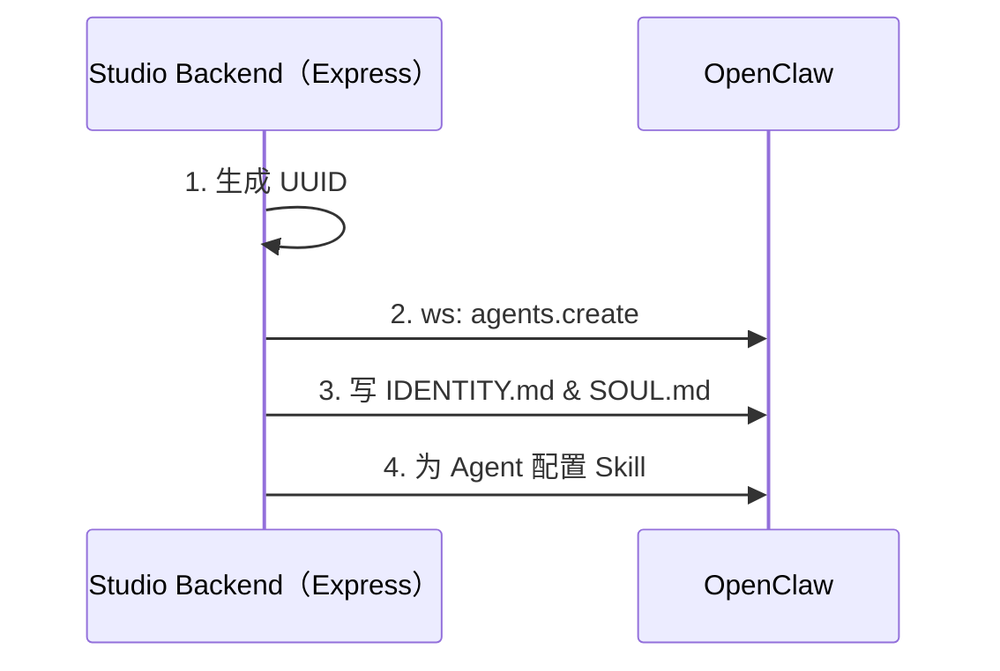
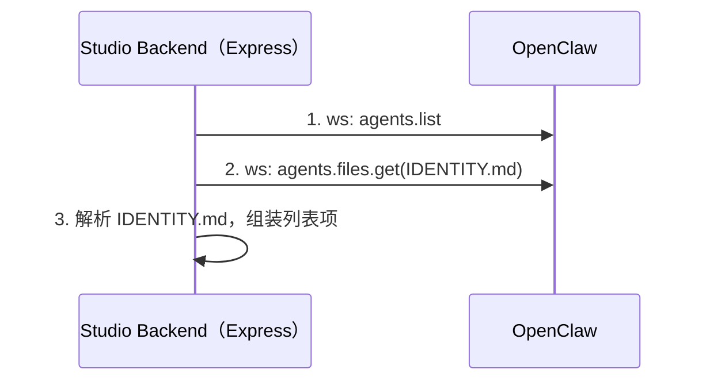
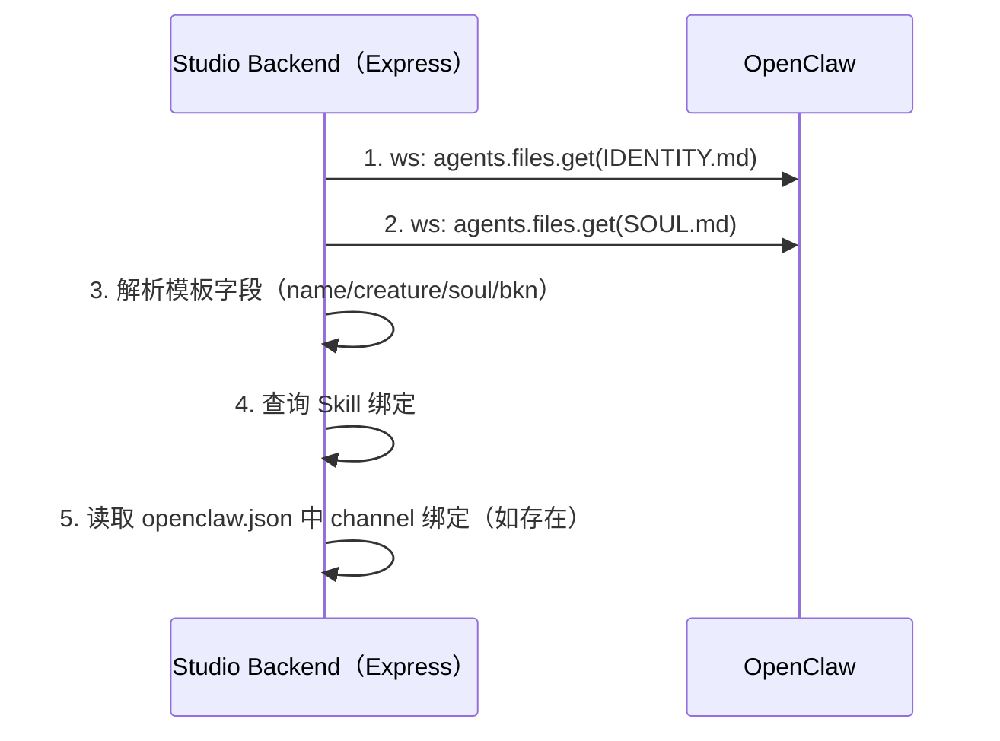
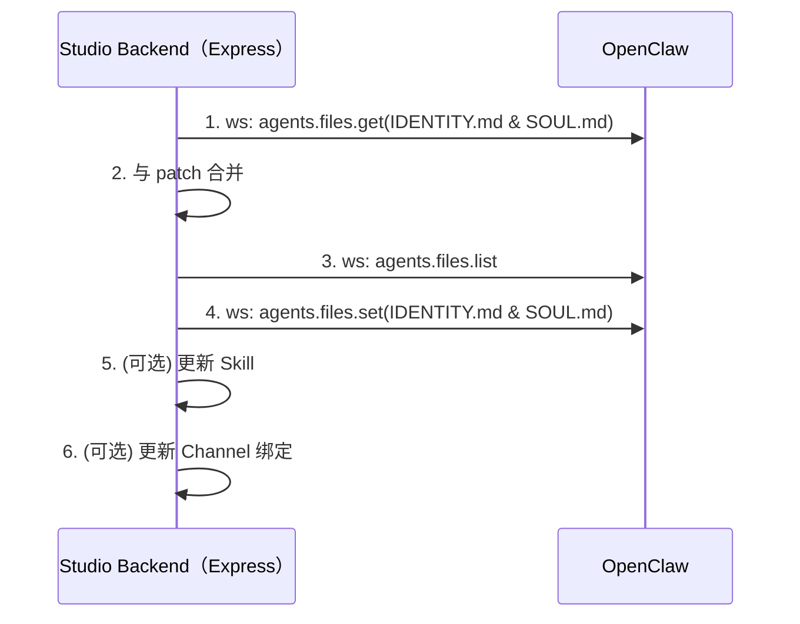
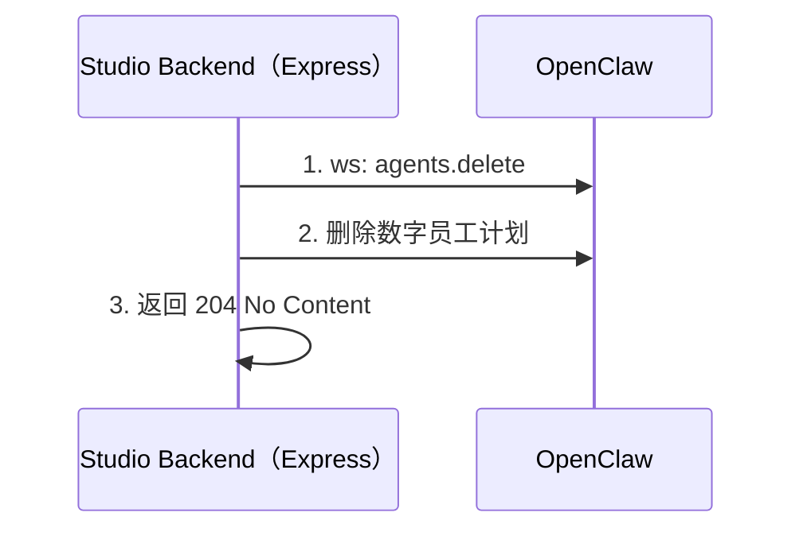

# 创建新的数字员工

## 业务流程

### 创建数字员工 Logic


1、生成 UUID
后端服务首先需要生成一个数字员工的 UUID。

2、创建 Agent
通过 OpenClaw 的 WebSocket RPC 执行 `agents.create` method。参考：@docs/references/openclaw-websocket-rpc.md。

3、更新 IDENTITY.md 和 SOUL.md
通过 OpenClaw 的 WebSocket RPC 执行 `agents.files.list` method 更新 IDENTITY.md 和 SOUL.md。其中SOUL.md通过@templates/de_agent_soul.pug为模版。 参考：@docs/references/openclaw-websocket-rpc.md。

4、为 Agent 配置 Skill
通过 /Users/lucyjiang/dipworkspace/ai-store/studio/src/logic/agent-skills.ts中AgentSkillsLogic.updateAgentSkills method来实现skill的管理
### 通过接口创建数字员工
提供 HTTP 接口来创建数字员工。
- endpoint: POST  /dip-studio/v1/digital-human

---

## 查询数字员工列表

### 数字员工列表 Logic


1、获取 Agent 列表  
通过 OpenClaw 的 WebSocket RPC 执行 `agents.list` method，获取全部 agent 基础信息。

2、读取每个 Agent 的 IDENTITY.md  
通过 OpenClaw 的 WebSocket RPC 执行 `agents.files.get` method（`name=IDENTITY.md`），用于读取数字员工的名称和角色信息。

3、组装列表返回结果  
优先使用 IDENTITY.md 解析出的 `name` 和 `creature`。当文件缺失或读取失败时，回退到 OpenClaw agent 的基础字段（如 `agent.name`）。

### 通过接口查询数字员工列表
提供 HTTP 接口查询数字员工列表。
- endpoint: GET /dip-studio/v1/digital-human

---

## 查询数字员工详情

### 数字员工详情 Logic


1、读取模板文件  
通过 OpenClaw 的 WebSocket RPC 执行 `agents.files.get` method，分别读取 `IDENTITY.md` 和 `SOUL.md`。

2、解析详情字段  
后端将两个文件内容合并并解析为详情字段：`name`、`creature`、`soul`、`bkn`。

3、补充 Skill 信息  
通过 `AgentSkillsLogic.getAgentSkills` 查询当前 agent 的 skill 绑定。

4、补充 Channel 信息  
读取 OpenClaw 配置中的 `bindings/channels`，若当前 agent 存在匹配项，则补充 `channel` 信息（feishu 或 dingtalk）。

### 通过接口查询数字员工详情
提供 HTTP 接口查询单个数字员工详情。
- endpoint: GET /dip-studio/v1/digital-human/:id

---

## 编辑数字员工

### 编辑数字员工 Logic


1、读取当前模板  
通过 OpenClaw 的 WebSocket RPC 执行 `agents.files.get` method，获取当前 `IDENTITY.md` 和 `SOUL.md`。

2、合并更新内容  
将请求中的 patch 字段与当前模板合并，仅更新传入字段，未传字段保持不变。

3、写回模板文件  
先调用 `agents.files.list`，再调用 `agents.files.set` 写回新的 `IDENTITY.md`、`SOUL.md`。

4、更新 Skill（可选）  
当请求包含 `skills` 字段时，通过 `AgentSkillsLogic.updateAgentSkills` 更新该 agent 的技能绑定。

5、更新 Channel（可选）  
当请求包含 `channel` 字段时，更新 OpenClaw 配置中的 channel 账号信息与 bindings。优先通过 `config.patch`；失败时降级写本地 `openclaw.json`。

### 通过接口编辑数字员工
提供 HTTP 接口编辑数字员工（部分更新语义）。
- endpoint: PUT /dip-studio/v1/digital-human/:id

---

## 删除数字员工

### 删除数字员工 Logic


1、删除 Agent  
通过 OpenClaw 的 WebSocket RPC 执行 `agents.delete` method。可通过 `deleteFiles` 控制是否删除 agent 工作目录。

2、从所有 cron 任务列表中筛选出 agentID 等于数字员工 ID 的 cron 任务，然后执行 `cron.remove` 进行删除。

3、错误映射  
当 OpenClaw 返回 agent 不存在相关错误时，后端转换为 404 语义返回。

### 通过接口删除数字员工
提供 HTTP 接口删除数字员工。
- endpoint: DELETE /dip-studio/v1/digital-human/:id
- query: `deleteFiles`（可选，默认按后端逻辑处理）


### 绑定 Channel 和 数字员工
创建、编辑数字员工时，如果修改了 Channel，需要重新绑定 Agent ↔ Channel 关系。为避免 OpenClaw 网关自动重启，需要遵循以下流程：

1. 调 "config.get" 拿当前配置（从 parsed 取对象）和 hash。
2. 在返回的 "config.bindings" 里追加一条 binding。
3. 转回 raw JSON
4. 用 "config.set" 写回完整配置，并带上 baseHash。
5. 示例绑定 Telegram ops account 到 work agent：

```json
{
  "type": "req",
  "id": "2",
  "method": "config.get",
  "params": {}
}
```

拿到：

```json
{
  "ok": true,
  "payload": {
    "hash": "...",
    "config": {}
  }
}
```

写回时：

```json
{
  "type": "req",
  "id": "3",
  "method": "config.set",
  "params": {
    "baseHash": "<config.get 返回的 hash>",
    "raw": "{\"bindings\":[{\"type\":\"route\",\"agentId\":\"work\",\"match\":{\"channel\":\"telegram\",\"accountId\":\"ops\"}}]}",
    "parsed": {
      bindings: {
        ...
      }
    }
  }
}
```

实际代码里 binding 结构是：

```typescript
{
  type?: "route";
  agentId: string;
  match: {
    channel: string;
    accountId?: string;
    peer?: { kind: "direct" | "group" | "channel"; id: string };
    guildId?: string;
    teamId?: string;
    roles?: string[];
  };
}
```

几个常见写法：

```json
{ "type": "route", "agentId": "work", "match": { "channel": "telegram", "accountId": "ops" } }
```

```json
{ "type": "route", "agentId": "work", "match": { "channel": "discord", "accountId": "*" } }
```

```json
{ "type": "route", "agentId": "opus", "match": { "channel": "whatsapp", "peer": { "kind": "direct", "id": "+15551234567" } } }
```

是否会重启网关：

- config.patch 和 config.apply 会主动调用 scheduleGatewaySigusr1Restart，所以会安排网关重启。
- config.set 只写配置，不主动调重启。
- OpenClaw 的配置热重载规则里 bindings 是 kind: "none"，不会要求 restart，也不会触发 channel restart。
- 所以要避免重启：用 config.get + config.set 写完整配置，不用 config.patch / config.apply。绑定类变更会在后续路由读取配置时生效，不需要重启 channel 连接。